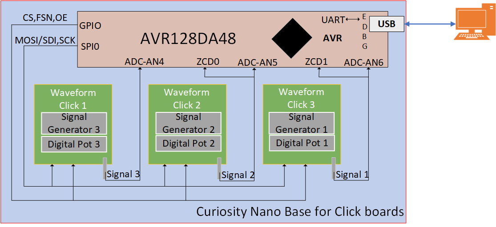
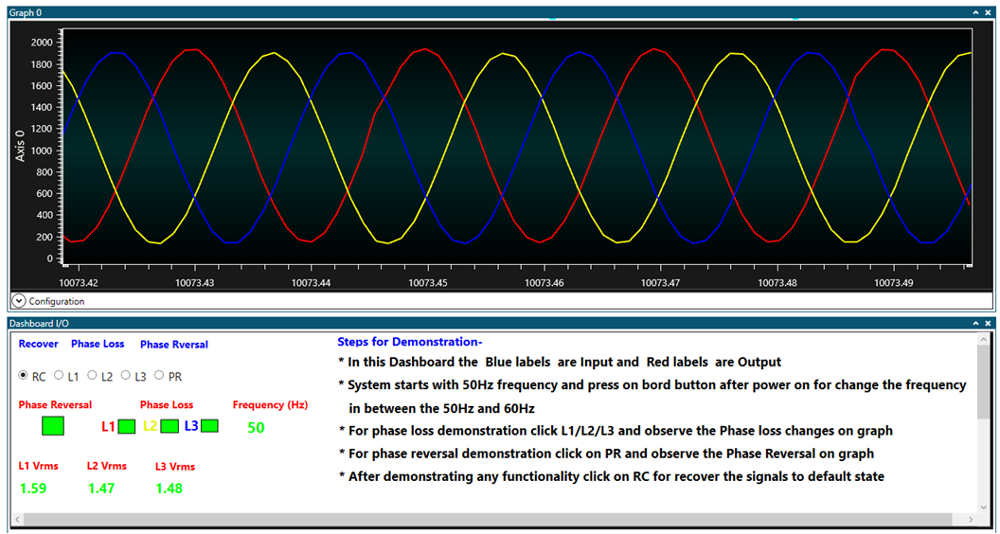

<!-- Please do not change this html logo with link -->

                                           ##Phase Sequence Detection of Three-Phase AC Supply

The AVR® DA family of microcontrollers are peripheral rich, high performance and low-power 8-bit microcontroller devices. The built-in Zero-Cross Detector (ZCD), high resolution Analog-to-Digital Converter (ADC), timer peripherals are essential for realizing phase sequence detection applications.

The application demonstrator showcases the phase sequence detection and phase loss detection on emulated three phase AC supply using AVR128DA48 microcontroller.

Phase Sequence Detection of Three-Phase AC Supply demonstration and implementation is discussed in the <a href="https://microchip.com/DS00003607" rel="nofollow">Application Note.

# Application Firmware

The demonstration is implemented with both AVR128DA48 and AVR128DA64 microcontrollers and it is available on microchip GitHub page-

* Using <a href="https://github.com/microchip-pic-avr-examples/avr128da48-phase-sequence-detection-of-ac-supply-mplab" rel="nofollow">AVR128DA48
* Using <a href="https://github.com/microchip-pic-avr-examples/avr128da64-phase-sequence-detection-of-ac-supply-mplab" rel="nofollow">AVR128DA64

# Software Used

Microchip’s IDEs, compiler and graphical code generators are used throughout the application firmware development to provide an easy and hassle-free user experience. 
Following are the tools which are used for this demo application:
* <a href="https://www.microchip.com/mplab/mplab-x-ide" rel="nofollow">MPLAB X (v5.40)
* <a href="https://www.microchip.com/mplab/compilers" rel="nofollow">XC8 compiler (v5.4.0)
* <a href="https://www.microchip.com/mplab/mplab-code-configurator" rel="nofollow">MPLAB® Code Configurator (v3.95.0)
* <a href="https://www.microchip.com/mplab/avr-support/data-visualizer" rel="nofollow">Standalone Data Visualizer (v2.20.674)

# Hardware Used

* <a href="https://www.microchip.com/DevelopmentTools/ProductDetails/PartNO/DM164151" rel="nofollow">AVR128DA48 Curiosity Nano board
* <a href="https://www.microchip.com/developmenttools/ProductDetails/AC164162" rel="nofollow">Curiosity Nano base for click boards
* <a href="https://www.mikroe.com/waveform-click" rel="nofollow">Three waveform clicks 
* SMA male cable 

# Demonstration Setup

The following steps explains the procedure for setting up the hardware for Three-Phase sequence detection using AVR128DA48 microcontroller, and figure 1 shows the hardware setup used for the application demo.
* Insert AVR128DA48 curiosity nano board in the curiosity nano slot of curiosity nano base for click boards.

**Note:** For proper orientation while inserting the curiosity nano board, refer the marking on curiosity nano base board.

* Insert three waveform clicks in the three mikroBUS slots available on Curiosity nano base board.
* Connect SMA output of the waveform clicks to the respective microcontroller I/O pins using SMA connectors. Refer Application Note section 3 for more information about microcontroller I/O pins.  
* Detach waveform click 2 OEN pin from mikroBUS slot2 PWM2 pin.
* Detach waveform click 3 CS pin from mikroBUS slot3 CS3 pin.
* Connect PWM2 pin of mikroBUS slot2 to pin PB5, and CS3 pin of mikroBUS slot3 to pin PB4.
* Connect the curiosity nano board to a host computer (PC) using the standard micro B USB cable.

  
   <strong>Figure 1: Demonstration Hardware Setup 

# Demonstration Operation

The data visualizer tool is used as a graphical user interface while demonstrating the application by displaying the emulated three phase supply waveforms, output status and for receiving the user inputs.
Pre-configured data streamer file and custom dashboard file is available with the firmware package. The below steps given for data visualizer configuration uses these files to get the setup ready.

Here is the list of Data Visualizer modules used for Demonstration –
* Serial Port (Baud Rate – 230400)
* Graph 
* Custom Dashboard (Custom Dashboard file is given for the demonstration) 
-	Element Label
-	Element Signal
-	Radio Group
* Data Streamer (Data Streamer file is given for the demonstration)  
Refer Data Visualizer User Guide for more information about <a href="http://ww1.microchip.com/downloads/Secure/en/DeviceDoc/40001903B.pdf" rel="nofollow">Data Visualizer. 

The demo uses an emulated three-phase AC supply to showcase the essential features of the application. To emulate the AC power supply three waveform clicks are used in the application.

**The following steps explains the procedure for demonstration after the demonstration setup is ready:** 

1.	Configure serial port for communication with the Curiosity nano board. 
2.	Configure data streamer for interfacing Graph window and Dashboard window with the serial port control panel. Data streamer configuration **(data-streamer-config.txt)** file is available in example firmware folder.
3.	Configure Graph window for displaying the emulated three phase supply AC waveforms, generated by the waveform clicks.
4.	Configure custom dashboard window to display the output and to receive user inputs. Custom dashboard **(custom-dashboard-config)** design file is available in example firmware folder. 
5.	The Blue labeled elements on custom dashboard are Inputs and Red labeled elements are Outputs.

**User inputs** 

-	Recover three-phase supply from faults
-	Insert phase loss fault on L1 phase
-	Insert phase loss fault on L2 phase
-	Insert phase loss fault on L3 phase
-	Insert phase reversal (PR) fault

**Application Output Indicators** 

-	Phase reversal status indicator
-	Phase loss status indicator
-	L1 Vrms, L2 Vrms, and L3 Vrms values
-	Operating Freq (Hz)
6.	Connect the hardware and prepare demonstrator setup as per the instructions provided in Demonstration setup section.
7.	Click Serial Port Control Panel Connect button.
8.	Using push button (SW0) on the curiosity nano board select appropriate frequency for the three-phase signal. The selected frequency is displayed on the custom dashboard window.
9.	Zoom in or Zoom out the graph on Graph window by clicking the +/- magnifier symbol below the Graph window.
10.	Insert phase loss fault by clicking the L1 radio button on dashboard, which disables the L1 signal out of three-phase signal to emulate phase loss input. 
11.	Insert phase loss fault by clicking the L2 radio button on dashboard, which disables the L2 signal out of three-phase signal to emulate phase loss input.
12.	Insert phase loss fault by clicking the L3 radio button on dashboard, which disables the L3 signal out of three-phase signal to emulate phase loss input.
13.	Insert phase reversal by clicking the PR radio button on dashboard, which changes the sequence of the three-phase signal to L1-L3-L2.

Figure 2 shows the Data Visualizer Dashboard for Phase Sequence Detection for Three-phase AC Supply.

  
   <strong>Figure 2: Data Visualizer Dashboard 

